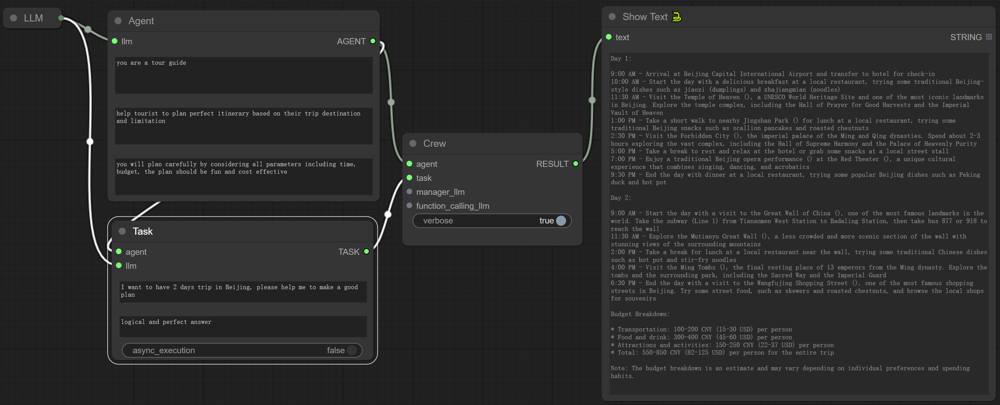

# ComfyUI-CrewAI

### Using ComfyUI to develop crews without any code.

Inspired by [ComfyUI](https://github.com/comfyanonymous/ComfyUI) and [CrewAI](https://www.crewai.com/), this project aims to develop nodes within ComfyUI that enable the execution of multi-agent tasks without requiring any coding.

### Nodes implemented
1. Crew, refer to [Crews](https://docs.crewai.com/core-concepts/Crews/)
2. LLM, although you can use node to set LLM for agent and crew, but you may still need to modify the nodes/crewai.py and set the `os.environ["OPENAI_API_KEY"] = "your key here" ` and `os.environ["OPENAI_API_BASE"] = "your base here" `
3. Agent, refer to [Agents](https://docs.crewai.com/core-concepts/Agents/)
4. Agent List
5. Task, refer to [Tasks](https://docs.crewai.com/core-concepts/Tasks/)
6. Task List
7. Tool list
8. Serper Dev tool, refer to [Serper Dev tool](https://docs.crewai.com/tools/SerperDevTool/) and you need modify the nodes/crewai.py and set the `os.environ["SERPER_API_KEY"] = "your key here" `
9. Scrape Website tool, refer to [Scrape Website tool](https://docs.crewai.com/tools/ScrapeWebsiteTool/)
10. File read tool, refer to [File read tool](https://docs.crewai.com/tools/FileReadTool/)
11. MDX search tool, refer to [MDX search tool](https://docs.crewai.com/tools/MDXSearchTool/)

### Installation
1. Install [ComfyUI](https://github.com/comfyanonymous/ComfyUI) by following the instructions on their GitHub page
2. Clone this repository to custom_nodes folder
3. Install requirements by running
`pip install -r requirements.txt`
or if you use portable (run this in ComfyUI_windows_portable -folder):
`python_embeded\python.exe -m pip install -r ComfyUI\custom_nodes\ComfyUI-CrewAI\requirements.txt`

### Future work
1. Add more tools to the list
2. Add more nodes to the list
3. Add same examples to the list

### License
[MIT](./LICENSE)